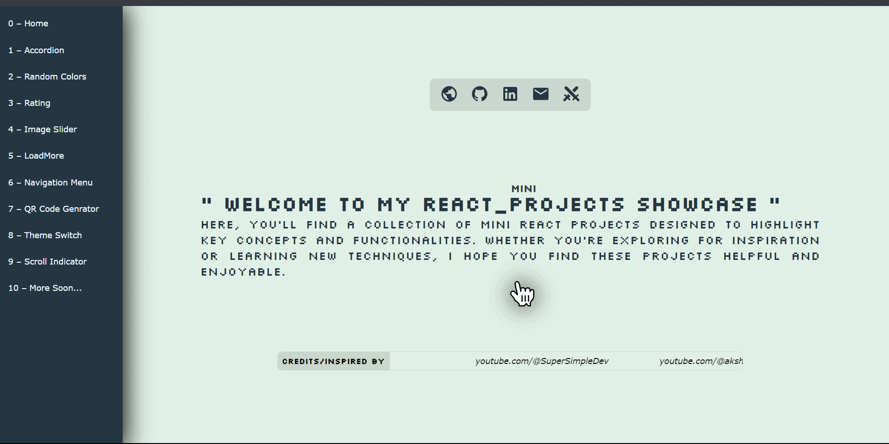

# React  Mini Projects Collection

Welcome to my **React Mini Projects** repository! This collection showcases a series of 10+ mini projects that I’ve built while learning and practicing React. Each project is designed to demonstrate different aspects of React and web development.

## Projects Included

0 – Home/Custom cursor  
1 – Accordion  
2 – Random Colors  
3 – Rating  
4 – Image Slider  
5 – Load More  
6 – Navigation Menu  
7 – QR Code Generator  
8 – Theme Switch  
9 – Scroll Indicator  

More Soon...

## Inspiration

I would like to give credit to the amazing creators who inspired these projects. Their tutorials and content helped shape the ideas behind many of the projects in this collection. Big thanks to:

- **[ SuperSimpleDev ]** – [YouTube](youtube.com/@SuperSimpleDev)
- **[ Akshay Saini ]** – [YouTube](youtube.com/@akshaymarch7)
- **[ Hitesh Choudhary ]** – [YouTube](youtube.com/@HiteshCodeLab)
- **[ Sangam Mukherjee ]** – [YouTube](youtube.com/@sangammukherjee)

Check out their original work to learn more!
